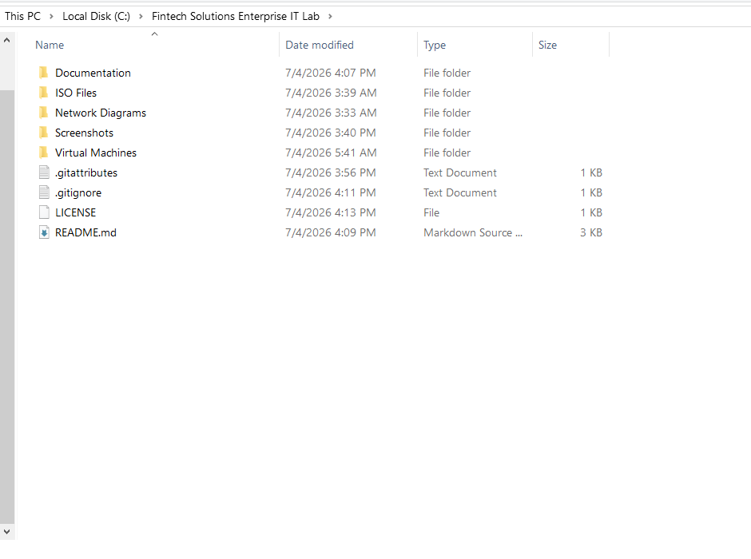
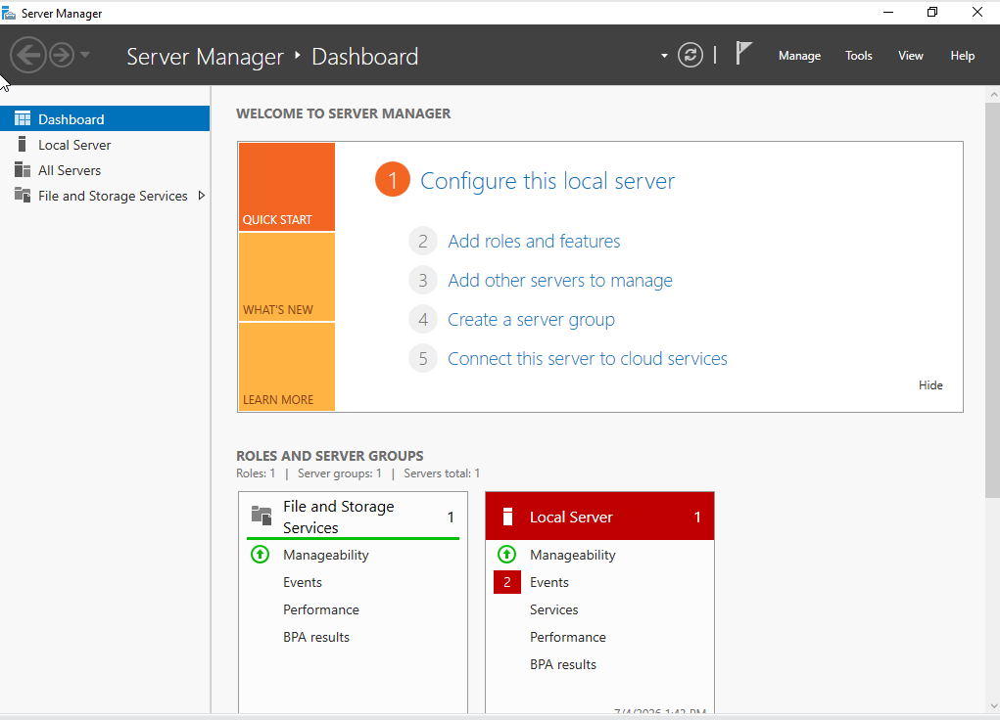
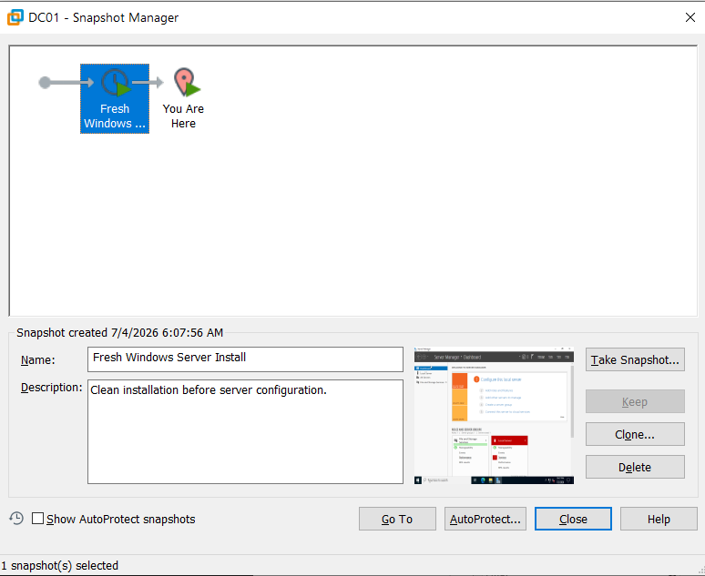
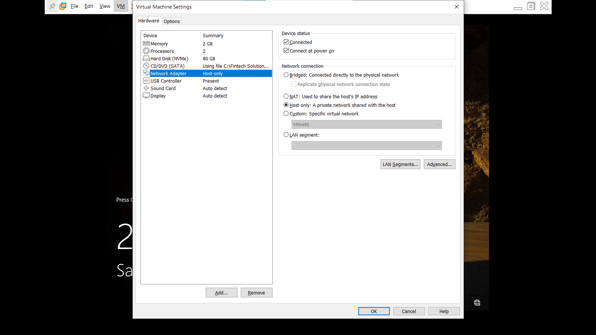
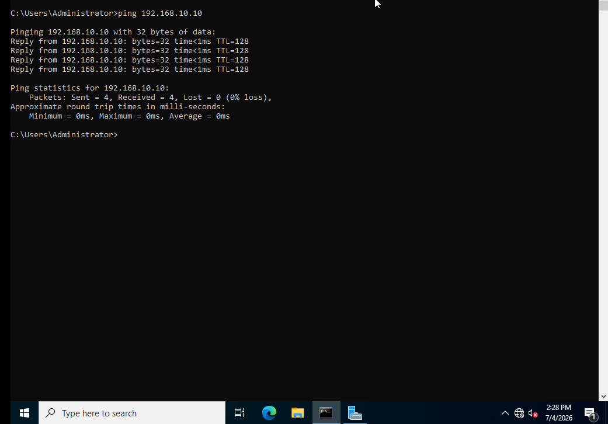
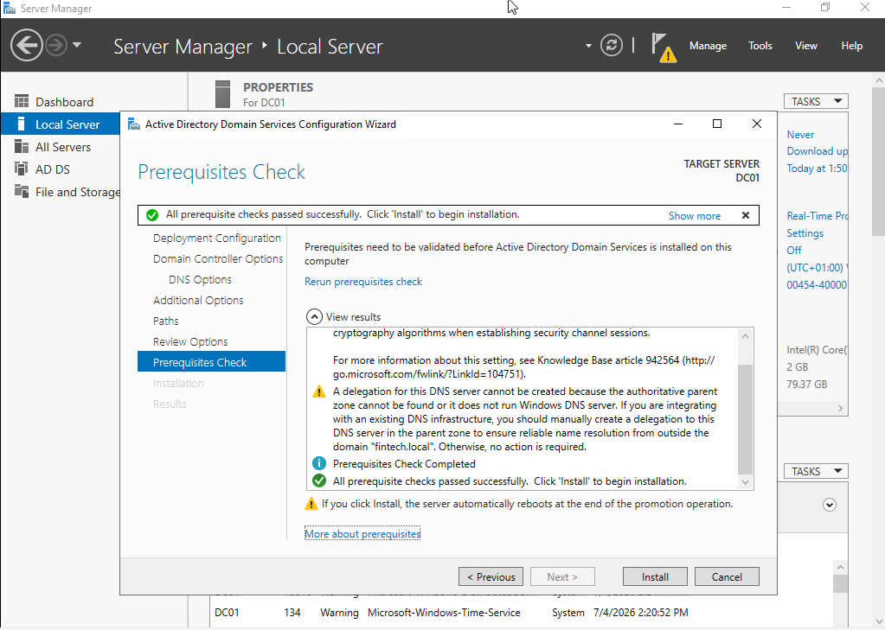
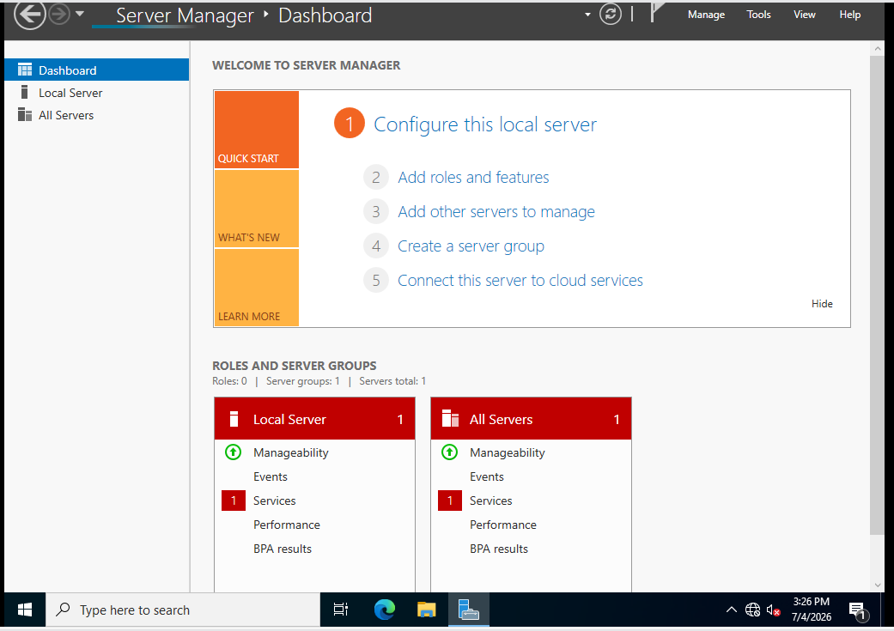
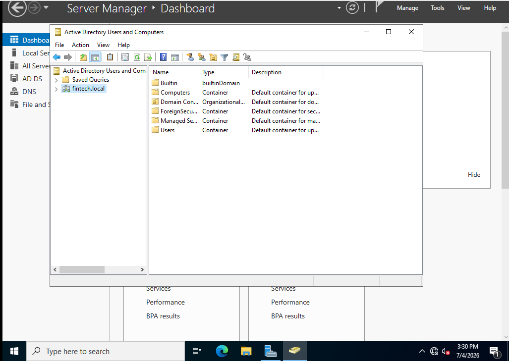

# Day 1 — Enterprise Infrastructure Deployment

## Project Overview

This document records the deployment of a simulated enterprise Windows infrastructure using VMware Workstation Pro. The objective is to build a production-like Active Directory environment while documenting every stage using enterprise IT documentation standards.

---

# Enterprise Lab Project Initialization

## Objective

Establish a structured project workspace for managing documentation, screenshots, virtual machines, deployment notes, and technical resources throughout the Enterprise IT Lab.

## Tasks Completed

- Created the Enterprise IT Lab project directory.
- Organized folders for:
  - Documentation
  - Screenshots
  - Virtual Machines
  - ISO Files
  - Network Diagrams
- Created the project README.
- Prepared the project for version control using Git and GitHub.

## Result

A standardized project structure was successfully created to support organized documentation and future lab expansion.

## Evidence

### Enterprise Lab Project Structure

**Purpose:** Displays the organized folder hierarchy used to manage the Enterprise IT Lab project.

---

# VMware Workstation Deployment

## Objective

Prepare the virtualization platform required to host the enterprise infrastructure.

## Tasks Completed

- Installed VMware Workstation Pro 17.
- Verified virtualization support.
- Configured VMware preferences.
- Configured Host-Only networking.
- Created the **DC01** virtual machine.

## Result

The virtualization environment is fully prepared to host enterprise servers and client operating systems.

## Evidence

### VMware Virtual Machine Configuration

**Purpose:** Shows the hardware configuration assigned to the **DC01** virtual machine before operating system deployment.

---

# Windows Server 2022 Deployment

## Objective

Deploy Windows Server 2022 Desktop Experience as the first enterprise server.

## Tasks Completed

- Installed Windows Server 2022 Desktop Experience.
- Completed the initial operating system setup.
- Verified successful installation.
- Confirmed Server Manager launched successfully.

## Result

Windows Server 2022 was successfully deployed and prepared for enterprise configuration.

## Evidence

### Windows Server Desktop

**Purpose:** Confirms the successful installation of Windows Server 2022 Desktop Experience.

### Server Manager

**Purpose:** Displays Server Manager immediately after Windows Server installation.

---

# Initial Server Configuration

## Objective

Configure the server identity before deploying Active Directory Domain Services.

## Tasks Completed

- Renamed the server to **DC01**.
- Verified Local Server configuration.
- Reviewed system information.
- Created a VMware recovery snapshot.

## Result

The server was successfully prepared for enterprise infrastructure deployment.

## Evidence

### Local Server Configuration

**Purpose:** Displays the Local Server configuration before Domain Controller promotion.

### Computer Renamed

**Purpose:** Confirms the server hostname was successfully changed to **DC01**.

### VMware Snapshot

**Purpose:** Documents the recovery snapshot created before major infrastructure changes.

---

# Enterprise Network Configuration

## Objective

Configure a static network configuration required for Active Directory and DNS services.

## Tasks Completed

- Configured VMware Host-Only networking.
- Assigned a static IPv4 address.
- Configured the subnet mask.
- Configured the preferred DNS server.
- Verified network connectivity.

## Result

DC01 now operates with a permanent enterprise network configuration suitable for Active Directory services.

## Evidence

### VMware Host-Only Network

**Purpose:** Displays the VMware Host-Only virtual network used throughout the Enterprise IT Lab.

### Static IP Configuration

**Purpose:** Shows the static IPv4 configuration assigned to **DC01**.

### IP Configuration Verification

**Purpose:** Verifies the configured network settings using `ipconfig /all`.

### — Connectivity Test

**Purpose:** Confirms successful network communication using the `ping` command.

---

# Active Directory Domain Services Deployment

## Objective

Deploy Active Directory Domain Services (AD DS) and promote **DC01** into the first Domain Controller within the enterprise environment.

## Tasks Completed

- Installed Active Directory Domain Services (AD DS).
- Installed DNS.
- Created the **fintech.local** forest.
- Promoted **DC01** to a Domain Controller.
- Restarted the server.
- Verified successful deployment.

## Result

The Active Directory infrastructure was successfully deployed and is fully operational.

## Evidence

###  AD DS Installation

**Purpose:** Confirms the successful installation of the Active Directory Domain Services role.

### AD DS Prerequisite Check

**Purpose:** Shows the successful completion of prerequisite validation before Domain Controller promotion.

### Server Manager After Promotion

**Purpose:** Displays Server Manager after the server was promoted to a Domain Controller.

### Active Directory Users and Computers

**Purpose:** Confirms that Active Directory Domain Services is operational.

---

# Day 1 Summary

## Technologies Used

- VMware Workstation Pro 17
- Windows Server 2022
- Active Directory Domain Services (AD DS)
- DNS
- Enterprise Networking
- Git
- GitHub
- Visual Studio Code
- Markdown

## Skills Demonstrated

- Enterprise Infrastructure Deployment
- Systems Administration
- Windows Server Administration
- Active Directory Administration
- Domain Controller Deployment
- DNS Configuration
- Static IP Configuration
- VMware Virtualization
- Technical Documentation
- IT Infrastructure Planning

## Project Status

- ✅ Enterprise project initialized
- ✅ VMware infrastructure deployed
- ✅ Windows Server installed
- ✅ Static network configured
- ✅ Active Directory deployed
- ✅ Domain Controller operational

---

# Next Phase — Day 2

- Organizational Units (OUs)
- User Account Management
- Security Groups
- Windows 11 Enterprise Deployment
- Domain Join
- Group Policy Objects (GPOs)
- Shared Folders