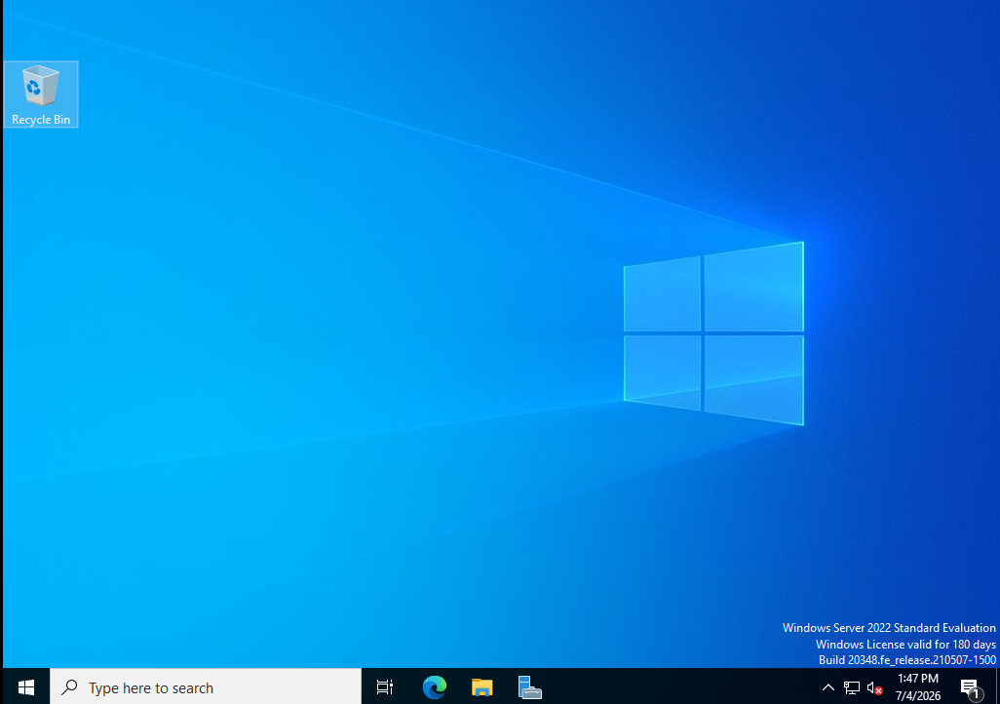
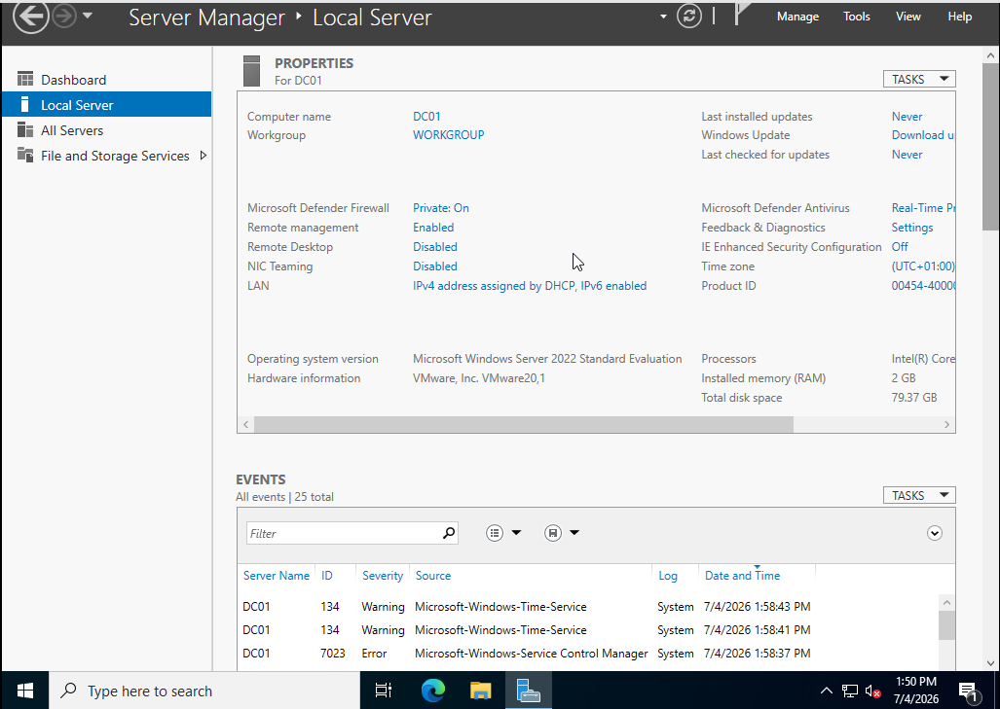
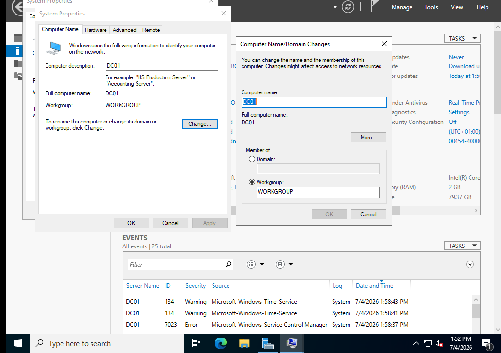
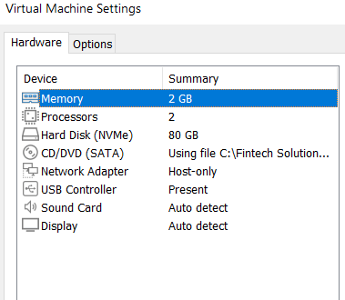
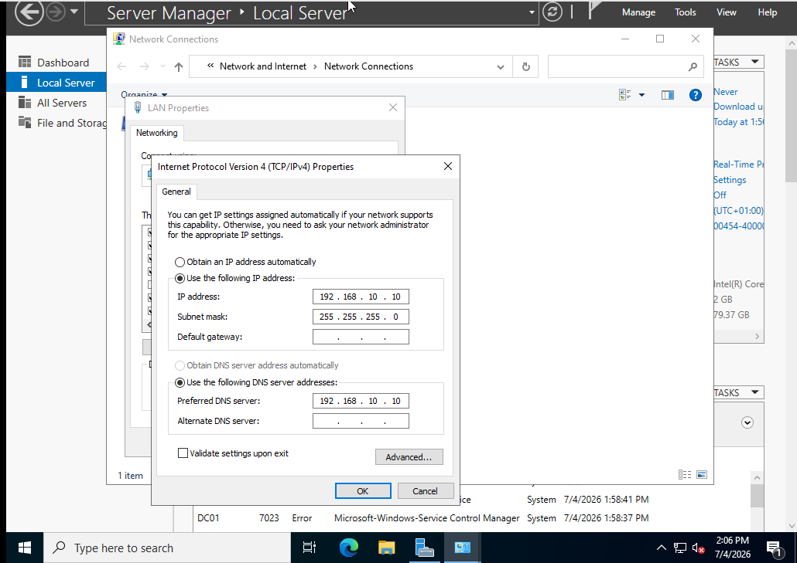
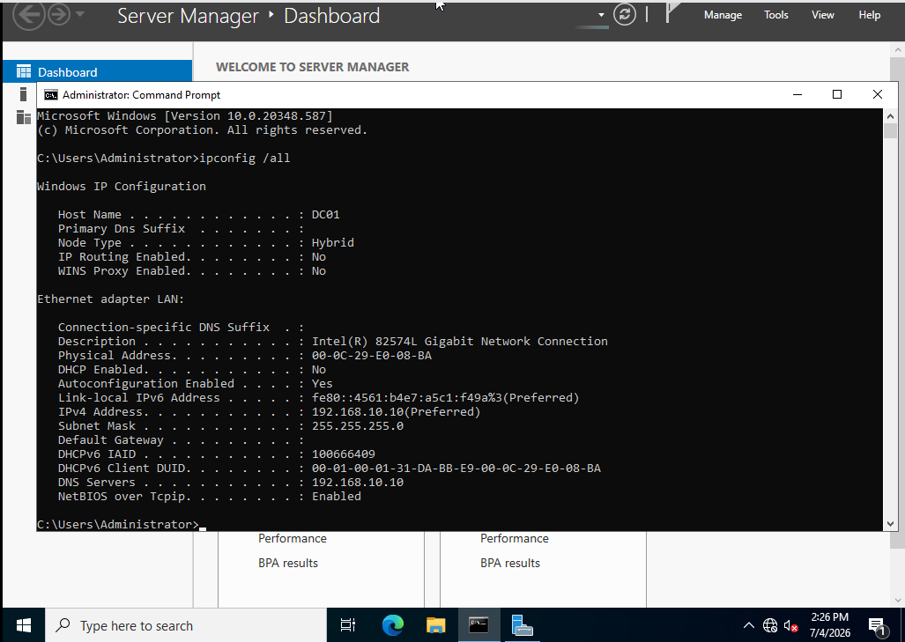
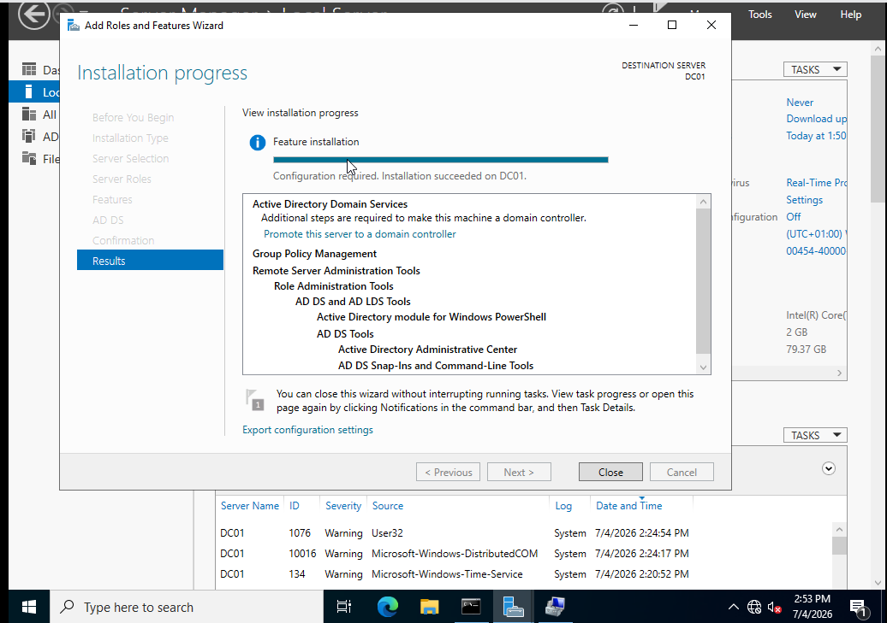
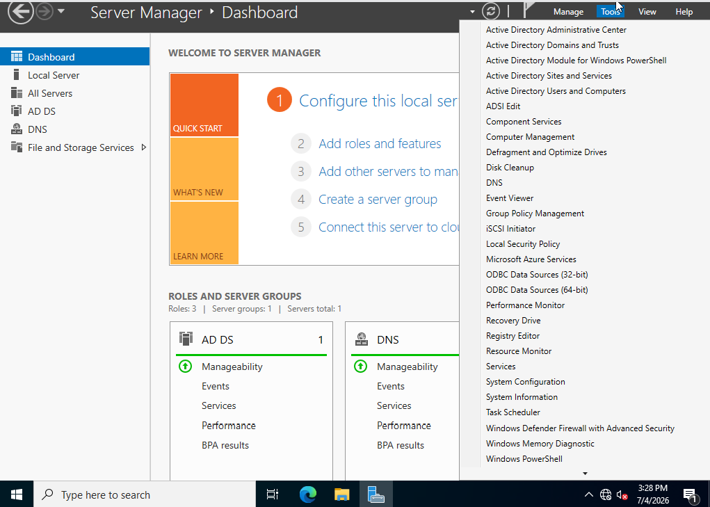
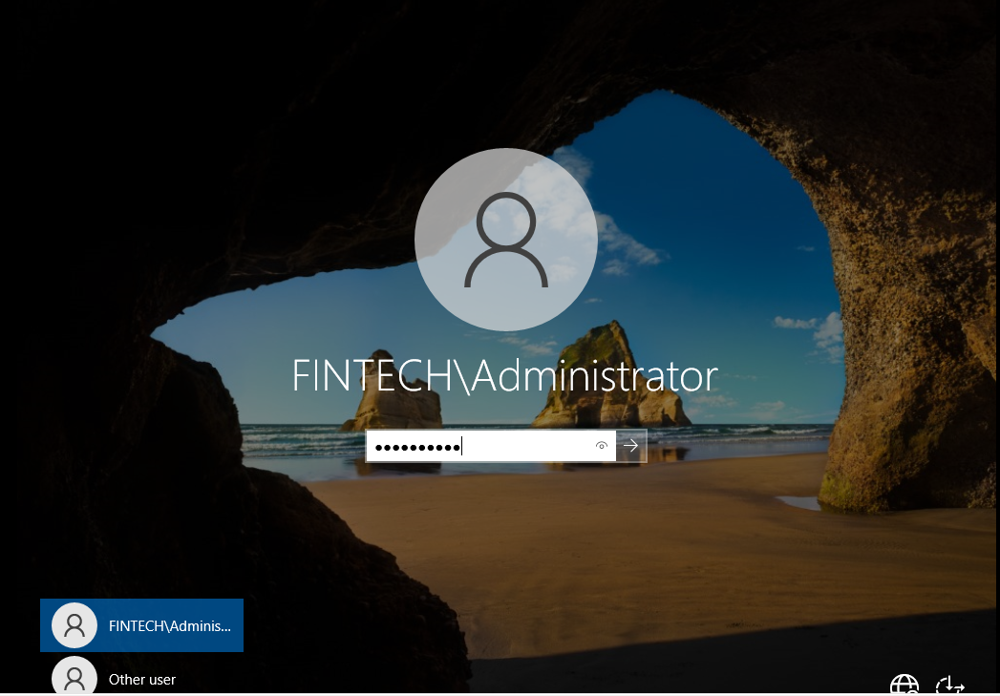

# Day 1 – Enterprise Infrastructure Deployment

## Objective

Deploy the first Windows Server 2022 Domain Controller (DC01) in a simulated enterprise environment using VMware Workstation Pro, configure enterprise networking, and promote the server to an Active Directory Domain Controller.

---

# Milestone 1 – VMware Workstation Setup

## Completed

- Installed VMware Workstation Pro 17
- Created the enterprise lab folder structure
- Configured VMware preferences and virtual networking

### Purpose

Prepared the virtualization environment that will host the enterprise infrastructure throughout this project.

### Screenshots

---

# Milestone 2 – Windows Server Deployment

## Completed

- Created the DC01 virtual machine
- Installed Windows Server 2022 Desktop Experience
- Verified successful installation

### Purpose

Deployed the first Windows Server that will serve as the enterprise Domain Controller.

### Screenshots

---

# Milestone 3 – Initial Server Configuration

## Completed

- Renamed the server to DC01
- Verified Local Server configuration
- Prepared the server for domain services

### Purpose

Configured the server identity before deploying Active Directory Domain Services.

### Screenshots

---

# Milestone 4 – Enterprise Network Configuration

## Completed

- Configured the Host-Only VMware network
- Assigned a static IPv4 address
- Configured the preferred DNS server
- Verified connectivity using ipconfig and ping

### Purpose

Established a stable network configuration required for Active Directory and DNS services.

### Screenshots

---

# Milestone 5 – Active Directory Domain Services (AD DS)

## Completed

- Installed the Active Directory Domain Services role
- Created a new forest
- Created the fintech.local domain
- Promoted DC01 to a Domain Controller
- Installed DNS
- Restarted and verified successful promotion

### Purpose

Established the enterprise identity infrastructure by deploying Active Directory Domain Services and DNS.

### Screenshots

---

# Summary

### Skills Practiced

- VMware Workstation Pro
- Windows Server 2022 Administration
- Enterprise Networking
- Static IP Configuration
- Active Directory Domain Services
- Domain Controller Promotion
- DNS
- Technical Documentation

### Status

- ✅ VMware Environment Ready
- ✅ Windows Server Installed
- ✅ Domain Controller Deployed
- ✅ Active Directory Operational
- ✅ DNS Operational

Next: Day 2 – Organizational Units (OUs), User Accounts, Security Groups, and Windows 11 Enterprise deployment.